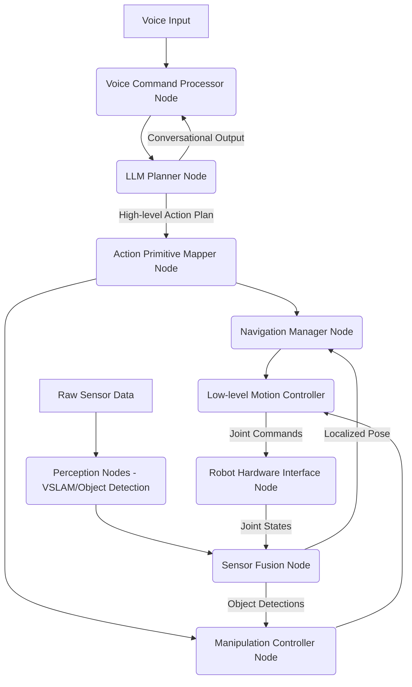

# System Architecture Design

Designing the system architecture for an autonomous humanoid robot capstone project involves orchestrating multiple ROS 2 nodes, data flows, and configuration elements into a cohesive and functional system. This chapter guides you through the process of designing a robust and scalable architecture, focusing on node graphs, communication patterns, and effective system management.

## Node Graph Design

A **node graph** visually represents the ROS 2 nodes in your system and their interconnections via topics, services, and actions. For a humanoid robot capable of voice commands, navigation, and manipulation, the node graph can become quite complex.


-   **Voice Input**: From microphone.
-   **Voice Command Processor Node**: Transcribes speech (e.g., using Whisper) and extracts initial intent.
-   **LLM Planner Node**: Takes high-level intent and current robot/environment state to generate action plans.
-   **Action Primitive Mapper Node**: Translates LLM's plan into concrete ROS 2 actions/commands.
-   **Navigation Manager Node**: Manages global and local navigation (using Nav2).
-   **Manipulation Controller Node**: Handles grasping, arm movements, and object placement.
-   **Perception Nodes**: Process raw sensor data for VSLAM, object detection.
-   **Sensor Fusion Node**: Combines data from various sensors (IMU, Odometry, VSLAM, object detection) for a comprehensive understanding of robot state and environment.
-   **Low-level Motion Controller**: Executes joint commands from navigation/manipulation.
-   **Robot Hardware Interface Node**: Communicates directly with physical robot actuators and reads sensor data.

## Topic/Service Mapping

Careful mapping of topics, services, and actions is essential for efficient communication.

### Key Topics and Message Types:
-   `/audio/input`: `audio_common_msgs/AudioData` (from microphone)
-   `/robot/voice_command`: `std_msgs/String` (text from Whisper)
-   `/robot/action_plan`: `std_msgs/String` (JSON plan from LLM Planner)
-   `/robot/command_status`: `std_msgs/String` (feedback from action mapper)
-   `/camera/image_raw`: `sensor_msgs/Image` (from cameras)
-   `/scan`: `sensor_msgs/LaserScan` (from LiDAR)
-   `/imu/data`: `sensor_msgs/Imu` (from IMU)
-   `/object_detections`: `vision_msgs/Detection2DArray`
-   `/robot_pose_ekf`: `geometry_msgs/PoseWithCovarianceStamped` (from sensor fusion)
-   `/cmd_vel`: `geometry_msgs/Twist` (velocity commands for base)
-   `/joint_states`: `sensor_msgs/JointState` (from robot hardware)
-   `/robot/speech_output`: `std_msgs/String` (robot's verbal response)

### Key Actions and Services:
-   `/navigate_to_pose`: `nav2_msgs/NavigateToPose` (Action for navigation)
-   `/pick_and_place`: `my_robot_actions/PickAndPlace` (Custom Action for manipulation)
-   `/set_joint_angles`: `my_robot_srvs/SetJointAngles` (Custom Service for direct joint control)

## Launch Organization

A well-structured set of launch files is critical for starting and managing the entire system. You'll typically have:
-   **Top-level Launch File**: Orchestrates the startup of all major components.
-   **Sub-launch Files**: For individual subsystems (e.g., `navigation.launch.py`, `perception.launch.py`, `hri.launch.py`).
-   **Robot Description Launch File**: Loads the URDF and `robot_state_publisher`.

### Example: Main Capstone Launch File

**`my_capstone_robot/launch/capstone_robot.launch.py`**
```python
import os
from launch import LaunchDescription
from launch.actions import IncludeLaunchDescription, DeclareLaunchArgument
from launch.launch_description_sources import PythonLaunchDescriptionSource
from launch.substitutions import LaunchConfiguration, PathJoinSubstitution
from ament_index_python.packages import get_package_share_directory

def generate_launch_description():
    # Declare arguments
    use_sim_time = DeclareLaunchArgument('use_sim_time', default_value='true',
                                         description='Use simulation (Gazebo) clock if true')
    robot_model = DeclareLaunchArgument('robot_model', default_value='humanoid_v1',
                                        description='Robot model to load')
    
    # Path to your robot description package
    robot_description_pkg = get_package_share_directory('my_robot_description')
    
    # Launch robot description (URDF + RSP)
    robot_description_launch = IncludeLaunchDescription(
        PythonLaunchDescriptionSource(
            os.path.join(robot_description_pkg, 'launch', 'robot_description.launch.py')
        ),
        launch_arguments={'robot_model': LaunchConfiguration('robot_model')}.items()
    )
    
    # Launch Gazebo simulation
    gazebo_launch = IncludeLaunchDescription(
        PythonLaunchDescriptionSource(
            os.path.join(get_package_share_directory('my_robot_simulation'), 'launch', 'robot_world.launch.py')
        ),
        launch_arguments={'use_sim_time': LaunchConfiguration('use_sim_time')}.items()
    )

    # Launch Nav2 stack
    navigation_launch = IncludeLaunchDescription(
        PythonLaunchDescriptionSource(
            os.path.join(get_package_share_directory('my_robot_navigation'), 'launch', 'navigation_bringup.launch.py')
        ),
        launch_arguments={'use_sim_time': LaunchConfiguration('use_sim_time')}.items()
    )

    # Launch HRI and AI agent stack
    hri_ai_launch = IncludeLaunchDescription(
        PythonLaunchDescriptionSource(
            os.path.join(get_package_share_directory('my_robot_hri'), 'launch', 'hri_agent_stack.launch.py')
        ),
        launch_arguments={'use_sim_time': LaunchConfiguration('use_sim_time')}.items()
    )

    return LaunchDescription([
        use_sim_time,
        robot_model,
        robot_description_launch,
        gazebo_launch,
        navigation_launch,
        hri_ai_launch,
    ])
```

## Configuration Management

Effective configuration management is key for adapting the robot to different tasks or environments. This involves:
-   **YAML Parameter Files**: Centralizing parameters for nodes in YAML files.
-   **Launch Arguments**: Using launch arguments to easily switch between configurations (e.g., simulation vs. real robot, different robot models).
-   **ROS 2 Params**: Using `ros2 param` commands for runtime parameter inspection and modification.

## Logging and Debugging

A robust logging and debugging strategy is essential for diagnosing issues in complex robotic systems.
-   **ROS 2 Logging**: Utilize `rclpy`'s logging mechanisms (`self.get_logger().info()`, `warn()`, `error()`).
-   **`rqt_console`**: A GUI tool for viewing ROS 2 log messages.
-   **`rqt_graph`**: Visualize the ROS graph (nodes and their connections) to understand data flow.
-   **`ros2 topic echo/info/list`**: Inspect topics for data content and types.
-   **`ros2 node info/list`**: Inspect node status.

## Testing Strategy

The Capstone Project requires a comprehensive testing strategy:
-   **Unit Testing Nodes**: Using `pytest` for Python nodes or `gtest` for C++ nodes.
-   **Integration Testing**: Verify communication and functionality between interconnected nodes (e.g., voice command → navigation → motion).
-   **Simulation Testing**: Thoroughly test all behaviors in Isaac Sim and Gazebo.
-   **Hardware Testing**: If physical hardware is available, test critical functions on the robot.
-   **Acceptance Testing**: Verify the robot meets the defined success criteria for the capstone task.
