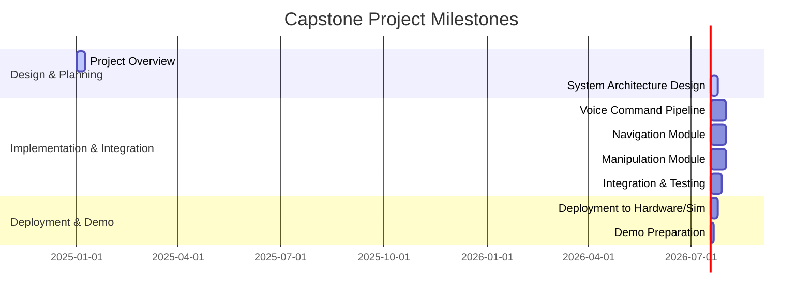

# Capstone Project Overview

The Capstone Project is the culmination of your journey through this book. It challenges you to integrate the knowledge and skills acquired in the preceding parts to design, build, and demonstrate an autonomous humanoid robot system. This chapter provides an overview of the project requirements, proposed system architecture, success criteria, and a breakdown of milestones.

## Capstone Requirements

The primary requirement for the Capstone Project is to demonstrate an autonomous humanoid robot performing a multi-modal interaction task in a simulated environment, with the potential for real-world deployment on specified hardware.

Key capabilities to be demonstrated:
-   **Voice Command Interface**: The robot should understand natural language commands.
-   **Navigation**: The robot should be able to navigate to specified locations, avoiding obstacles.
-   **Object Interaction**: The robot should be able to detect, pick up, and place objects.
-   **Conversational Interaction**: The robot should engage in basic conversations, maintaining context.
-   **Multi-modal Fusion**: Integrate vision and speech for robust command interpretation.

## System Architecture

The proposed system architecture for the autonomous humanoid robot integrates various ROS 2 nodes, AI models, and simulation tools discussed throughout the book.

```mermaid
graph TD
    H[Human User] -- Voice Command --> V(Voice Command Processing Pipeline)
    V -- Text Command --> L(Cognitive Planning LLM)
    L -- Action Plan (JSON) --> A(Action Primitive Mapper)
    A -- ROS 2 Actions/Commands --> R(Robot Controller Nodes)

    S[Sensor Data (Vision, LiDAR, IMU)] --> P(Perception Nodes - VSLAM, Object Detection)
    P --> L
    P --> R
    
    R -- Robot State/Telemetry --> L
    R -- Actuator Commands --> RH[Robot Hardware / Simulation]
    RH -- Real-World Feedback --> S

    style H fill:#f9f,stroke:#333,stroke-width:2px
    style RH fill:#ccf,stroke:#333,stroke-width:2px
```
**Timeline for Capstone Project:**



## Success Criteria

Successful completion of the Capstone Project will be evaluated based on the following criteria:
-   **Functional Demonstration**: The robot successfully performs the defined multi-modal interaction task in simulation.
-   **Code Quality**: Well-structured, documented, and tested ROS 2 packages and Python scripts.
-   **System Robustness**: The robot operates reliably, handling minor perturbations and ambiguous commands gracefully.
-   **Architectural Soundness**: The integrated system demonstrates a clear understanding and application of the architectural principles discussed.
-   **Report/Documentation**: Clear documentation of the system design, implementation details, and evaluation results.

## Milestone Breakdown

The project will be broken down into manageable milestones, aligning with the chapters of this part of the book. Each milestone will have specific deliverables and checkpoints for validation.

1.  **Project Overview and Design**: Define specific task, hardware, and software choices.
2.  **Voice Command Pipeline**: Implement speech recognition, intent parsing, and action mapping.
3.  **Navigation Module**: Integrate localization, mapping, and path planning.
4.  **Manipulation Module**: Implement object detection, grasping, and placement.
5.  **System Integration**: Combine all modules into a cohesive system.
6.  **Testing and Refinement**: Thoroughly test the integrated system in simulation.
7.  **Deployment and Demonstration**: Prepare for deployment to hardware (if applicable) and final demonstration.

## Assessment Rubric

The project will be assessed based on:
-   **Completeness**: How well the system meets the defined requirements.
-   **Correctness**: Accuracy and reliability of robot's behavior.
-   **Code Quality**: Readability, maintainability, and adherence to best practices.
-   **Documentation**: Clarity and thoroughness of project documentation.
-   **Innovation**: Originality or advanced techniques applied (optional).
-   **Presentation**: Clarity and effectiveness of the final demonstration.
