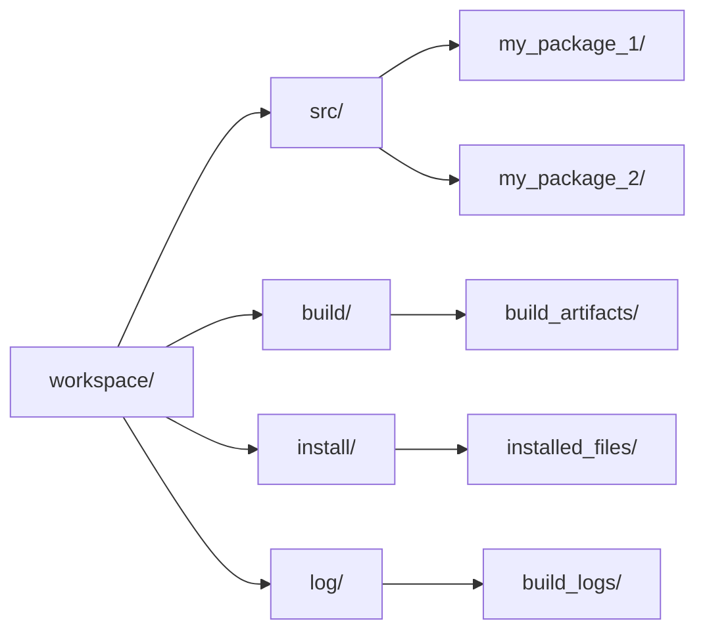

# ROS 2 Architecture & Core Concepts

The Robot Operating System (ROS) has become the de facto standard for robotic software development. ROS 2 is the successor to ROS 1, bringing significant improvements, particularly in areas critical for modern robotics like real-time communication, security, and support for diverse platforms.

## ROS 1 vs ROS 2: Why Upgrade?

ROS 1, while revolutionary, had limitations that became apparent as robotics evolved. ROS 2 was re-architected from the ground up to address these challenges.

| Feature            | ROS 1                                   | ROS 2                                                        |
| :----------------- | :-------------------------------------- | :----------------------------------------------------------- |
| **Communication**  | Custom TCP/IP (TCPROS), UDP (UDPROS)    | DDS (Data Distribution Service)                              |
| **Real-time**      | Best-effort, not real-time              | Supports real-time (with appropriate OS/hardware)            |
| **Security**       | None by default                         | DDS-Security (Authentication, Authorization, Encryption)     |
| **Multi-robot**    | Challenging, single ROS master          | Natively supports multi-robot systems                        |
| **Platforms**      | Primarily Linux                         | Linux, Windows, macOS, RTOS                                  |
| **Quality of Service (QoS)** | Limited                         | Configurable QoS policies (reliability, durability, etc.)    |
| **Lifecycle**      | Manual node startup/shutdown            | Managed node lifecycles (configurable states)                |
| **Tooling**        | `catkin_make`, `rosrun`, `rosnode`      | `colcon build`, `ros2 run`, `ros2 node`                      |

The transition to DDS-based communication is the most fundamental change, enabling ROS 2 to be more distributed, robust, and secure.

## DDS (Data Distribution Service) Explained

DDS is an international standard for publish-subscribe (pub/sub) data exchange in distributed real-time systems. It forms the communication backbone of ROS 2.

**Key characteristics of DDS:**
-   **Decentralized**: No central broker (like ROS Master in ROS 1). Nodes can discover each other directly.
-   **Platform Independent**: Works across different operating systems and hardware.
-   **Quality of Service (QoS)**: Offers a rich set of policies to configure communication behavior (e.g., reliability, history, deadline, durability).
-   **Security**: Built-in mechanisms for authentication, authorization, and encryption of data.

In ROS 2, nodes communicate directly via DDS, offering greater resilience and lower latency compared to ROS 1's master-slave architecture.

## Workspace Structure: src, build, install, log

A ROS 2 workspace is a directory where you develop, build, and install your ROS 2 packages. It typically consists of four main directories:



-   **`src/`**: Contains the source code of your ROS 2 packages (e.g., `my_package_1`, `my_package_2`).
-   **`build/`**: Stores intermediate build files for each package.
-   **`install/`**: Where the final built and installed files (executables, libraries, Python modules, launch files) for each package reside. This is the directory you `source` to make your packages available.
-   **`log/`**: Contains log files generated during the build process.

### Creating a ROS 2 Workspace

```bash
# Create a new workspace directory
mkdir -p ~/ros2_ws/src
cd ~/ros2_ws/src

# Create a dummy package (optional, for testing workspace)
ros2 pkg create --build-type ament_python my_dummy_package

# Navigate back to workspace root
cd ~/ros2_ws

# Build the workspace
colcon build

# Source the workspace setup file (essential for using your packages)
source install/setup.bash
```

## Packages, Nodes, Executables

-   **Packages**: The fundamental unit of ROS 2 software organization. A package contains nodes, libraries, datasets, configuration files, and more. Each package has a `package.xml` (metadata) and a build system configuration (e.g., `CMakeLists.txt` for C++, `setup.py` for Python).
-   **Nodes**: Executables that perform computation. Nodes are typically designed to be modular, performing a single task (e.g., a node to read sensor data, a node to control motors).
-   **Executables**: The actual programs that can be run from within a ROS 2 package. A package can contain multiple executables (e.g., a Python script, a C++ program).

## colcon Build System

`colcon` is the primary build tool for ROS 2. It's a command-line tool that can build multiple packages in a workspace, handling their dependencies. It's designed to be flexible and extensible.

**Common `colcon` commands:**
-   `colcon build`: Builds all packages in the current workspace.
-   `colcon build --packages-select <package_name>`: Builds only a specific package.
-   `colcon build --symlink-install`: Creates symbolic links for installed files, useful for development as changes to Python files (for instance) are immediately reflected without rebuilding.
-   `colcol test`: Runs tests for packages.

`colcon` builds packages in topological order, ensuring that dependencies are built before the packages that depend on them.
