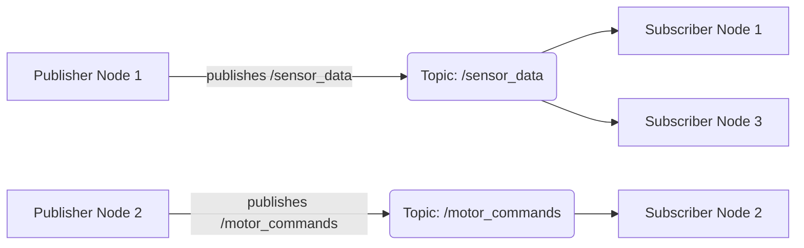
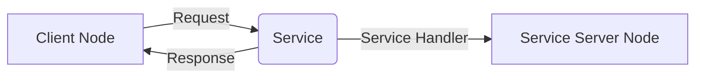
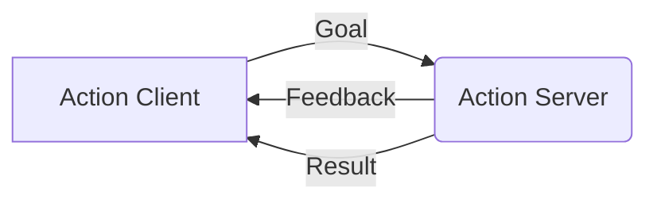

# Nodes, Topics, and Services

Nodes, topics, and services form the fundamental communication mechanisms in ROS 2. Understanding how these elements interact is crucial for building distributed robotic applications.

## Nodes: Building Blocks of ROS 2

A **node** is an executable that performs computation. In ROS 2, nodes are typically isolated processes designed to do one thing well. This modularity allows for:
- **Fault isolation**: If one node crashes, others can continue to operate.
- **Reusability**: Nodes can be reused in different applications or across different robots.
- **Distribution**: Nodes can run on different machines or even different operating systems, communicating seamlessly.

Each node has a unique name within the ROS graph, allowing other nodes to identify and interact with it.

## Topics: Pub/Sub Pattern

**Topics** are a named bus over which nodes exchange messages using a publish-subscribe (pub/sub) pattern.
-   **Publishers**: Nodes that send messages to a topic.
-   **Subscribers**: Nodes that receive messages from a topic.

This decoupled communication mechanism means publishers and subscribers don't need to know about each other's existence. They only need to agree on the topic name and message type.



### Messages: std_msgs, geometry_msgs

Messages are data structures used for communication over topics. ROS 2 provides a rich set of standard message types, organized into packages:
-   **`std_msgs`**: Contains basic data types like `String`, `Int32`, `Float64`, `Bool`.
-   **`geometry_msgs`**: Defines common geometric primitives like `Point`, `Pose`, `Twist` (linear and angular velocity).
-   **`sensor_msgs`**: For sensor data like `Image`, `PointCloud2`, `Imu`.

You can also define custom message types for application-specific data.

### Example: Simple Publisher and Subscriber

**`my_python_package/my_python_package/simple_publisher.py`**
```python
import rclpy
from rclpy.node import Node
from std_msgs.msg import String

class SimplePublisher(Node):
    def __init__(self):
        super().__init__('simple_publisher')
        self.publisher_ = self.create_publisher(String, 'my_topic', 10)
        timer_period = 0.5  # seconds
        self.timer = self.create_timer(timer_period, self.timer_callback)
        self.i = 0

    def timer_callback(self):
        msg = String()
        msg.data = 'Hello ROS 2! %d' % self.i
        self.publisher_.publish(msg)
        self.get_logger().info('Publishing: "%s"' % msg.data)
        self.i += 1

def main(args=None):
    rclpy.init(args=args)
    simple_publisher = SimplePublisher()
    rclpy.spin(simple_publisher)
    simple_publisher.destroy_node()
    rclpy.shutdown()

if __name__ == '__main__':
    main()
```

**`my_python_package/my_python_package/simple_subscriber.py`**
```python
import rclpy
from rclpy.node import Node
from std_msgs.msg import String

class SimpleSubscriber(Node):
    def __init__(self):
        super().__init__('simple_subscriber')
        self.subscription = self.create_subscription(
            String,
            'my_topic',
            self.listener_callback,
            10)
        self.subscription  # prevent unused variable warning

    def listener_callback(self, msg):
        self.get_logger().info('I heard: "%s"' % msg.data)

def main(args=None):
    rclpy.init(args=args)
    simple_subscriber = SimpleSubscriber()
    rclpy.spin(simple_subscriber)
    simple_subscriber.destroy_node()
    rclpy.shutdown()

if __name__ == '__main__':
    main()
```

## Services: Request/Response

**Services** are a communication mechanism in ROS 2 that implements a request/response pattern. They are used for synchronous, blocking calls where a client sends a request and waits for a server to send back a response.



### Example: Simple Service Server and Client

**`my_python_package/my_python_package/simple_service_server.py`**
```python
import rclpy
from rclpy.node import Node
from example_interfaces.srv import AddTwoInts # Standard service type

class SimpleServiceServer(Node):
    def __init__(self):
        super().__init__('simple_service_server')
        self.srv = self.create_service(AddTwoInts, 'add_two_ints', self.add_two_ints_callback)
        self.get_logger().info('Service server ready.')

    def add_two_ints_callback(self, request, response):
        response.sum = request.a + request.b
        self.get_logger().info(f'Incoming request: a={request.a}, b={request.b}. Sum: {response.sum}')
        return response

def main(args=None):
    rclpy.init(args=args)
    simple_service_server = SimpleServiceServer()
    rclpy.spin(simple_service_server)
    simple_service_server.destroy_node()
    rclpy.shutdown()

if __name__ == '__main__':
    main()
```

**`my_python_package/my_python_package/simple_service_client.py`**
```python
import sys
import rclpy
from rclpy.node import Node
from example_interfaces.srv import AddTwoInts

class SimpleServiceClient(Node):
    def __init__(self):
        super().__init__('simple_service_client')
        self.client = self.create_client(AddTwoInts, 'add_two_ints')
        while not self.client.wait_for_service(timeout_sec=1.0):
            self.get_logger().info('service not available, waiting again...')
        self.req = AddTwoInts.Request()

    def send_request(self, a, b):
        self.req.a = a
        self.req.b = b
        self.future = self.client.call_async(self.req)
        rclpy.spin_until_future_complete(self, self.future)
        return self.future.result()

def main(args=None):
    rclpy.init(args=args)
    simple_service_client = SimpleServiceClient()
    
    if len(sys.argv) != 3:
        simple_service_client.get_logger().info('Usage: ros2 run my_python_package simple_service_client A B')
        simple_service_client.destroy_node()
        rclpy.shutdown()
        sys.exit(1)

    a = int(sys.argv[1])
    b = int(sys.argv[2])
    response = simple_service_client.send_request(a, b)
    simple_service_client.get_logger().info(f'Result of add_two_ints: for {a} + {b} = {response.sum}')
    
    simple_service_client.destroy_node()
    rclpy.shutdown()

if __name__ == '__main__':
    main()
```

## Actions: Long-running tasks

**Actions** are a high-level communication type for long-running, goal-oriented tasks. They combine aspects of topics (for feedback) and services (for a goal and result).
An action client sends a goal, receives continuous feedback, and eventually gets a result. An action server processes the goal, publishes feedback, and sends a final result.



## QoS Settings

**Quality of Service (QoS)** policies in ROS 2 allow you to configure the behavior of communication between nodes. This is crucial for matching the communication needs of different parts of a robotic system (e.g., high-frequency sensor data vs. critical command messages).

Common QoS policies include:
-   **History**: How many messages to keep.
-   **Depth**: How many messages to keep for `KEEP_LAST` history.
-   **Reliability**: `Reliable` (guaranteed delivery) vs. `Best Effort` (faster, no guarantees).
-   **Durability**: `Transient Local` (new subscribers get last published message) vs. `Volatile` (only messages published while subscriber is active).
-   **Liveliness**: How long the system should consider a publisher alive.

These settings are configured when creating publishers, subscribers, service clients/servers, and action clients/servers.
