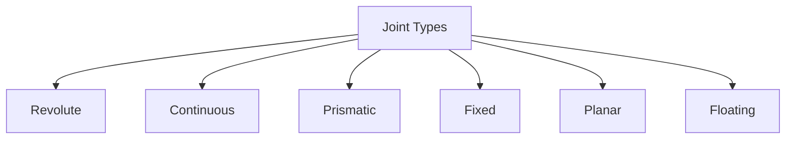

# Understanding URDF for Humanoids

The Unified Robot Description Format (URDF) is an XML format used in ROS to describe all elements of a robot. This includes its kinematic and dynamic properties, visual appearance, and collision geometry. For humanoid robots, URDF is crucial for accurate simulation, motion planning, and visualization.

## URDF (Unified Robot Description Format)

URDF allows you to specify the physical characteristics of your robot model. A URDF file is essentially a tree-like structure of `<link>` and `<joint>` elements.

-   **`<link>`**: Represents a rigid body part of the robot (e.g., torso, upper arm, hand). It defines the visual, collision, and inertial properties of that part.
-   **`<joint>`**: Represents the kinematic and dynamic connection between two links. It defines the type of joint (e.g., revolute, prismatic), its axis of rotation/translation, limits, and dynamics.

## XML Structure: links, joints

A basic URDF structure for a simple humanoid might look like this:

```xml
<?xml version="1.0"?>
<robot name="simple_humanoid">

  <!-- Base Link (e.g., torso) -->
  <link name="torso">
    <visual>
      <geometry><box size="0.2 0.4 0.6"/></geometry>
      <material name="blue"><color rgba="0 0 0.8 1"/></material>
    </visual>
    <collision>
      <geometry><box size="0.2 0.4 0.6"/></geometry>
    </collision>
    <inertial>
      <origin xyz="0 0 0" rpy="0 0 0"/>
      <mass value="10.0"/>
      <inertia ixx="1.0" ixy="0.0" ixz="0.0" iyy="1.0" iyz="0.0" izz="1.0"/>
    </inertial>
  </link>

  <!-- Left Arm Link -->
  <link name="left_upper_arm">
    <visual>
      <geometry><cylinder radius="0.05" length="0.3"/></geometry>
      <material name="red"><color rgba="0.8 0 0 1"/></material>
    </visual>
    <collision>
      <geometry><cylinder radius="0.05" length="0.3"/></geometry>
    </collision>
    <inertial>
      <origin xyz="0 0 0" rpy="0 0 0"/>
      <mass value="1.0"/>
      <inertia ixx="0.1" ixy="0.0" ixz="0.0" iyy="0.1" iyz="0.0" izz="0.1"/>
    </inertial>
  </link>

  <!-- Joint connecting torso and left_upper_arm -->
  <joint name="torso_to_left_arm_joint" type="revolute">
    <parent link="torso"/>
    <child link="left_upper_arm"/>
    <origin xyz="0 0.25 0.3" rpy="0 0 0"/> <!-- Position relative to parent -->
    <axis xyz="0 1 0"/>                   <!-- Axis of rotation (Y-axis) -->
    <limit lower="-1.57" upper="1.57" effort="100" velocity="10"/>
  </joint>

  <!-- Materials for visual elements -->
  <material name="blue"/>
  <material name="red"/>

</robot>
```

## Visual, collision, inertial properties

Each `<link>` can define three types of properties:
-   **`<visual>`**: Describes the graphical model of the link, used for rendering in visualization tools like RViz2. It can use basic geometries (box, cylinder, sphere) or mesh files (DAE, STL, OBJ).
-   **`<collision>`**: Defines the geometry used for collision detection in physics simulators. It's often simpler than the visual geometry to save computational resources.
-   **`<inertial>`**: Specifies the mass and inertia tensor of the link, crucial for realistic physics simulation.

## Joint types: revolute, prismatic, fixed, continuous

URDF supports several joint types, defining how connected links can move relative to each other:

-   **`revolute`**: A single axis of rotation, with a limited range (e.g., elbow, knee).
-   **`continuous`**: A single axis of rotation, with an unlimited range (e.g., a wheel, a spinning motor).
-   **`prismatic`**: A single axis of translation (linear movement), with a limited range (e.g., a linear actuator).
-   **`fixed`**: No movement between links. Used to attach parts rigidly or create a kinematic chain.
-   **`planar`**: Allows movement in a plane (2 DOF for translation, 1 DOF for rotation). Less common for humanoid.
-   **`floating`**: Allows full 6 DOF movement. Typically used for the base of a robot in a free-floating configuration.



## Building simple humanoid URDF

Creating a full humanoid URDF from scratch is a complex task. It involves defining dozens of links and joints, carefully calculating origins and axes, and specifying all visual, collision, and inertial properties. Tools like SolidWorks, Blender, or Fusion 360 with URDF export plugins can significantly aid this process.

For this book, we will focus on understanding the structure and integrating existing humanoid URDFs, or building simplified models to grasp core concepts.

## Visualizing in RViz2

**RViz2** is the 3D visualization tool for ROS 2. It allows you to visualize your robot model, sensor data, and motion plans.

To visualize your URDF:

1.  Launch RViz2:
    ```bash
    rviz2
    ```
2.  In RViz2, add a `RobotModel` display type.
3.  Set the `Description Topic` property of the `RobotModel` to `/robot_description`.
4.  Launch a `robot_state_publisher` node to broadcast the URDF:
    ```bash
    ros2 run robot_state_publisher robot_state_publisher --ros-args -p robot_description:="<your_urdf_content_here_or_path_to_urdf>"
    ```
    (Often this is done via a launch file that reads your URDF).

This allows you to see the kinematic structure and visual representation of your humanoid robot model.
