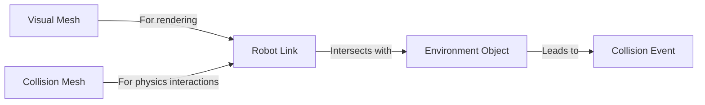

# Simulating Physics, Gravity, and Collisions

Accurate physics simulation is at the heart of any realistic robotics simulation. Gazebo provides a powerful physics engine that allows you to model how robots interact with their environment, including gravity, collisions, and various physical properties.

## Physics Engines: DART, Bullet, ODE

Gazebo supports several physics engines, each with its strengths and weaknesses:
-   **ODE (Open Dynamics Engine)**: The default engine for many Gazebo versions. It's stable and well-tested.
-   **Bullet**: A popular open-source physics engine used in many games and simulations. Known for robust collision detection.
-   **DART (Dynamic Animation and Robotics Toolkit)**: Optimized for robotics, DART excels in simulating complex articulated bodies and contact dynamics.
-   **Simbody**: A high-performance, multi-body dynamics library suitable for biomechanics and robotics.

You can select the physics engine in your Gazebo world file.

## Gravity Configuration

Gravity is a fundamental force in any realistic simulation. In Gazebo, you can configure the gravity vector within your SDF world file. The default is typically Earth's gravity (-9.8 m/s² in the Z-direction).

```xml
<world name="my_world">
  <gravity>0 0 -9.8</gravity> <!-- Earth's gravity in negative Z direction -->
  <!-- ... other world elements ... -->
</world>
```

You can also set custom gravity values to simulate different planets or scenarios.

## Collision Detection

Collision detection is the process of identifying when two or more objects in the simulation intersect. This is crucial for preventing interpenetration and triggering contact responses.
-   **`<collision>` tag in URDF/SDF**: Defines the geometric shape used for collision detection for a link. This geometry is often simplified (e.g., a bounding box or cylinder) compared to the visual mesh to improve performance.
-   **Collision Pair**: When two collision geometries intersect, a "collision pair" is registered.



## Friction and Contact Parameters

When objects collide, their interaction involves friction. Gazebo allows you to define various contact parameters within the `<surface>` tag of a link's collision properties:
-   **`<friction>`**: Defines static and dynamic friction coefficients (`mu1`, `mu2`) for sliding friction, and optional torsional friction.
-   **`<contact>`**: Configures contact properties like stiffness, damping, and maximum depth for penetration.

### Example: Physics Configuration XML

This example demonstrates configuring physics parameters in a Gazebo world file, including engine selection and contact properties.

```xml
<?xml version="1.0" ?>
<sdf version="1.7">
  <world name="friction_test_world">
    <plugin name="ignition::gazebo::systems::Physics" filename="ignition-gazebo-physics-system"/>
    <gravity>0 0 -9.8</gravity>

    <physics name="default_physics" type="ode">
      <max_step_size>0.001</max_step_size>
      <real_time_factor>1.0</real_time_factor>
      <real_time_update_rate>1000</real_time_update_rate>
      <ode>
        <solver>
          <type>quick</type>
          <iters>50</iters>
          <precon_iters>0</precon_iters>
          <sor>1.3</sor>
          <erp>0.2</erp>
          <cfm>0</cfm>
          <split_impulse>true</split_impulse>
          <split_impulse_penetration_threshold>-0.01</split_impulse_penetration_threshold>
        </solver>
        <constraints>
          <cfm>0</cfm>
          <erp>0.2</erp>
          <contact_max_correcting_vel>100.0</contact_max_correcting_vel>
          <contact_surface_layer>0.001</contact_surface_layer>
        </constraints>
      </ode>
    </physics>

    <!-- Example Model with Custom Friction -->
    <model name="sliding_block">
      <link name="block_link">
        <collision name="collision">
          <geometry><box><size>0.1 0.1 0.1</size></box></geometry>
          <surface>
            <friction>
              <ode>
                <mu>1.0</mu>
                <mu2>1.0</mu2>
                <fdir1>0 0 0</fdir1>
                <slip1>0</slip1>
                <slip2>0</slip2>
              </ode>
            </friction>
          </surface>
        </collision>
        <visual name="visual">
          <geometry><box><size>0.1 0.1 0.1</size></box></geometry>
          <material><script><uri>file://media/materials/scripts/gazebo.material</uri><name>Gazebo/Green</name></script></material>
        </visual>
        <inertial>
          <mass>1.0</mass>
          <inertia><ixx>0.001</ixx><ixy>0</ixy><ixz>0</ixz><iyy>0.001</iyy><iyz>0</iyz><izz>0.001</izz></inertia>
        </inertial>
      </link>
      <pose>0 0 0.5 0 0 0</pose>
    </model>

    <include>
      <uri>model://ground_plane</uri>
    </include>
    <include>
      <uri>model://sun</uri>
    </include>

  </world>
</sdf>
```

## Inertia Calculations

**Inertial properties** (mass, center of mass, and inertia tensor) are critical for accurate dynamic simulation. The `<inertial>` tag within a link defines these properties.
-   **`mass`**: Total mass of the link in kilograms.
-   **`origin`**: Center of mass of the link, relative to the link's origin.
-   **`inertia`**: A 3x3 symmetric matrix representing the moment of inertia tensor. For simple geometries, Gazebo can automatically calculate this if not provided, but for complex shapes, it's best to compute them using CAD software.

## Physics Step Size

The **physics step size** (`max_step_size`) defines the discrete time interval used by the physics engine to advance the simulation.
-   **Smaller step size**: More accurate simulation, but computationally more expensive and slower.
-   **Larger step size**: Faster simulation, but can lead to instabilities or inaccurate results, especially for fast-moving or colliding objects.

You can configure `max_step_size` and `real_time_update_rate` in the `<physics>` tag of your world file to balance accuracy and simulation speed.
