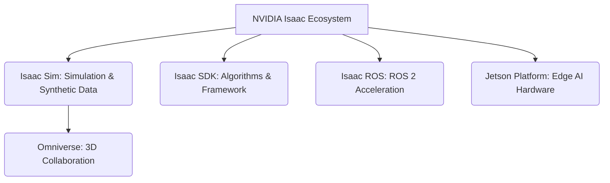

# NVIDIA Isaac SDK and Isaac Sim Overview

NVIDIA Isaac is a comprehensive platform for accelerating the development and deployment of AI-powered robots. It comprises a rich ecosystem of tools, frameworks, and APIs designed to simplify the creation of advanced robotic applications. At its core are Isaac SDK and Isaac Sim, which provide powerful capabilities for simulation, perception, navigation, and manipulation.

## Isaac Ecosystem Components

The NVIDIA Isaac ecosystem is vast, encompassing several key components:
-   **Isaac Sim**: A scalable robotics simulation application built on NVIDIA Omniverse. It offers photorealistic rendering, accurate physics, and advanced sensor simulation, making it ideal for synthetic data generation and AI training.
-   **Isaac SDK**: A software development kit providing a collection of robot perception, navigation, and manipulation algorithms and tools. It includes a framework for building modular robotic applications.
-   **Isaac ROS**: A collection of hardware-accelerated ROS 2 packages that leverage NVIDIA GPUs for high-performance perception and AI processing on ROS-enabled robots.
-   **Jetson Platform**: NVIDIA's embedded computing platform for edge AI, providing the hardware for deploying Isaac-powered robots.
-   **Omniverse**: A platform for connecting and building 3D workflows, on which Isaac Sim is based.



## Isaac Sim (Omniverse-based)

Isaac Sim is built on NVIDIA Omniverse, a platform that enables universal interchange and collaboration in 3D workflows. This foundation provides Isaac Sim with:
-   **High Fidelity**: Photorealistic rendering, realistic lighting, and advanced materials.
-   **Accurate Physics**: Powered by NVIDIA PhysX, it offers robust and scalable physics simulation.
-   **Synthetic Data Generation**: Advanced tools (like Isaac Replicator) for generating diverse and labeled datasets to train AI models.
-   **ROS 2 Bridge**: Seamless integration with ROS 2 for controlling robots and streaming sensor data.

## Isaac ROS vs Isaac SDK

While both are part of the Isaac ecosystem, they serve slightly different purposes:
-   **Isaac SDK**: A broader, more comprehensive development kit focused on building entire robotic applications using a proprietary framework. It provides lower-level access and more control for custom solutions.
-   **Isaac ROS**: Specifically designed to provide GPU-accelerated ROS 2 packages. It's for developers who want to leverage the ROS 2 framework and ecosystem while benefiting from NVIDIA's hardware acceleration for perception and AI tasks.

This book will primarily focus on `Isaac Sim` for simulation and synthetic data, and `Isaac ROS` for ROS 2 integration.

## Hardware Requirements

NVIDIA Isaac tools, especially Isaac Sim, are computationally intensive and highly leverage NVIDIA GPUs.
-   **GPU**: An NVIDIA RTX series GPU (30-series or newer recommended) with ample VRAM (8GB+).
-   **CPU**: A modern multi-core CPU (Intel Core i7 or AMD Ryzen 7 equivalent or better).
-   **RAM**: 32 GB or more.
-   **OS**: Ubuntu Linux 20.04 or 22.04 LTS is typically required.

## Installation and Licensing

NVIDIA Isaac Sim requires the NVIDIA Omniverse Launcher for installation and management.
1.  **NVIDIA Drivers**: Ensure you have the latest NVIDIA GPU drivers installed.
2.  **Omniverse Launcher**: Download and install the Omniverse Launcher from the [NVIDIA Developer website](https://developer.nvidia.com/omniverse-platform).
3.  **Isaac Sim Installation**:
    *   Open the Omniverse Launcher.
    *   Navigate to the "Exchange" tab.
    *   Search for "Isaac Sim" and click "Install".
    *   Follow the on-screen instructions to complete the installation.
    *   Ensure to install relevant extensions, particularly the ROS 2 Bridge extension.

## First Scene Creation

Once Isaac Sim is installed, you can launch it and begin creating your first scene.

### Python Scripting Basics for Isaac Sim

Isaac Sim is highly scriptable using Python. You can create, manipulate, and simulate environments programmatically.

```python
# Conceptual Python script for Isaac Sim

import omni.usd
import omni.isaac.core as ic
import numpy as np

# Initialize Isaac Sim core
ic.simulate.set_max_time_step(1.0 / 60.0) # Set simulation step to 60 FPS
stage = ic.get_current_stage()

# Create a physics scene
physics_scene = ic.physics.add_physics_material_to_stage()

# Add a ground plane
ic.prims.create_prim(
    prim_path="/World/GroundPlane",
    usd_path=ic.utils.get_usd_path("Props/Simple/Sphere.usd"), # Placeholder USD
    scale=np.array([1000, 1000, 1]), # Large scale for ground
    position=np.array([0, 0, 0])
)

# Add a cube
cube_prim = ic.prims.create_prim(
    prim_path="/World/Cube",
    usd_path=ic.utils.get_usd_path("Props/Simple/Cube.usd"),
    scale=np.array([1, 1, 1]),
    position=np.array([0, 0, 1]),
    name="my_first_cube"
)

# Simulate for a few steps (conceptual)
# ic.simulate.play()
# for i in range(100):
#     ic.simulate.step()
# ic.simulate.stop()

print("Simple Isaac Sim scene created with a ground plane and a cube.")
```
This script demonstrates how to programmatically add basic elements to an Isaac Sim scene. Actual interaction and simulation control involve more advanced APIs.
