# Humanoid Robot Kinematics and Dynamics

Understanding the kinematics and dynamics of a humanoid robot is fundamental to controlling its movements, planning trajectories, and simulating its interactions with the environment. Kinematics describes the geometry of motion without considering the forces that cause it, while dynamics deals with the relationship between forces and motion.

## Forward Kinematics

**Forward kinematics (FK)** is the process of calculating the position and orientation (pose) of an end-effector (e.g., a robot's hand or foot) in 3D space, given the joint angles (or positions) of the robot's arm or leg.

For a serial chain robot, FK is typically computed by sequentially applying transformation matrices (rotation and translation) from the base frame to each subsequent joint, until the end-effector frame is reached.

## Inverse Kinematics (IK)

**Inverse kinematics (IK)** is the inverse problem: calculating the required joint angles to achieve a desired end-effector pose. IK is significantly more complex than FK because:
-   **Multiple Solutions**: There might be multiple sets of joint angles that result in the same end-effector pose.
-   **No Solution**: The desired pose might be unreachable (outside the robot's workspace).
-   **Computational Cost**: Solving IK often involves iterative numerical methods.

For humanoid robots, IK is essential for tasks like reaching for objects, stepping onto specific locations, or maintaining balance.

## Denavit-Hartenberg Parameters

**Denavit-Hartenberg (DH) parameters** are a widely used convention for systematically representing the kinematic structure of robotic manipulators. A set of four parameters (a, α, d, θ) uniquely describes the relationship between two consecutive links in a serial chain.

```mermaid
graph TD
    A[Link i-1] -->|a_i-1, &#x03B1;_i-1| J_i-1[Joint i-1]
    J_i-1 -->|d_i, &#x03B8;_i| L_i[Link i]
```


-   `a`: The length of the common normal between joint axes.
-   `α`: The angle between joint axes about the common normal.
-   `d`: The distance along the joint axis.
-   `θ`: The angle between common normals.

## Dynamics: Forces and Torques

**Dynamics** deals with the relationship between the forces and torques acting on a robot and its resulting motion (acceleration). This is critical for:
-   **Trajectory Tracking**: Calculating the motor torques required to follow a planned trajectory.
-   **Force Control**: Interacting with the environment with a desired force.
-   **Balance Control**: Maintaining stability for bipedal robots against gravity and external disturbances.

Key concepts in dynamics include:
-   **Mass and Inertia**: Properties of links.
-   **Gravity**: Force acting on the robot's mass.
-   **External Forces/Torques**: Interactions with the environment.
-   **Joint Torques**: Forces applied by motors.

## PyBullet Simulation

**PyBullet** is a Python module for the Bullet Physics SDK, offering fast and accurate physics simulation. It's an excellent tool for:
-   **Robot Simulation**: Loading URDF/SDF models and simulating their dynamics.
-   **Kinematics**: Computing FK and solving IK.
-   **Reinforcement Learning**: Interfacing with RL environments.

### Example: FK Calculation, IK Solver, PyBullet Setup (Conceptual)

This conceptual Python code demonstrates basic PyBullet setup, forward kinematics, and inverse kinematics.

```python
import pybullet as p
import pybullet_data
import time
import numpy as np

# 1. PyBullet Setup
physicsClient = p.connect(p.GUI) # or p.DIRECT for non-graphical version
p.setAdditionalSearchPath(pybullet_data.getDataPath())
p.setGravity(0, 0, -9.81) # Earth's gravity

# Load a robot model (e.g., a simplified humanoid or manipulator)
# Replace 'r2d2.urdf' with your humanoid's URDF path
robot = p.loadURDF("r2d2.urdf", useFixedBase=True)

# Get number of joints
num_joints = p.getNumJoints(robot)
print(f"Robot has {num_joints} joints.")

# Get joint info and find controllable joints
controllable_joints = []
for i in range(num_joints):
    joint_info = p.getJointInfo(robot, i)
    joint_type = joint_info[2]
    if joint_type == p.JOINT_REVOLUTE or joint_type == p.JOINT_PRISMATIC:
        controllable_joints.append(i)
        print(f"Joint {i}: {joint_info[1].decode('UTF-8')}, Type: {joint_type}")

# 2. Forward Kinematics (Conceptual)
# Let's say we want the pose of a specific end-effector link (e.g., a hand)
end_effector_link_index = 6 # Example link index, needs to be found for your robot

# Get the current state of the end-effector
# This is essentially FK: given current joint positions, what's the EE pose?
link_state = p.getLinkState(robot, end_effector_link_index)
ee_position = link_state[0]
ee_orientation = link_state[1] # Quaternion
print(f"End-effector position (FK): {np.round(ee_position, 3)}")

# 3. Inverse Kinematics Solver (Conceptual)
# Target end-effector position and orientation
target_position = [0.5, 0.5, 0.5]
target_orientation = p.getQuaternionFromEuler([0, 0, 0]) # Example: zero orientation

# Use IK solver to find joint angles
max_iterations = 100
damping_ratio = 0.01 # Damping helps with singularity avoidance

joint_dofs = [] # Degrees of freedom for each controllable joint
joint_ranges = [] # Joint limits

# Populate joint_dofs and joint_ranges based on your robot's URDF
for joint_idx in controllable_joints:
    joint_info = p.getJointInfo(robot, joint_idx)
    joint_lower_limit = joint_info[8]
    joint_upper_limit = joint_info[9]
    joint_ranges.append(joint_upper_limit - joint_lower_limit) # Range for that joint
    joint_dofs.append(1) # Assuming 1 DOF per revolute/prismatic joint

# Simplified IK - requires setting correct maxForce and maxVelocity for each joint
solved_joint_positions = p.calculateInverseKinematics(
    robot,
    end_effector_link_index,
    target_position,
    targetOrientation=target_orientation,
    lowerLimits=[jl[0] for jl in p.getJointInfo(robot, j) for j in controllable_joints], # Example, replace with actual
    upperLimits=[jl[1] for jl in p.getJointInfo(robot, j) for j in controllable_joints], # Example, replace with actual
    jointRanges=joint_ranges,
    restPoses=[0.0] * len(controllable_joints), # Rest pose for the joints
    jointDamping=[0.1] * len(controllable_joints)
)

# Apply solved joint positions
# for i, joint_idx in enumerate(controllable_joints):
#     p.setJointMotorControl2(robot, joint_idx, p.POSITION_CONTROL, targetPosition=solved_joint_positions[i])

print(f"Target position: {target_position}")
print(f"Solved joint positions (IK): {np.round(solved_joint_positions, 3)}")


# Keep simulation running for visualization
# while p.isConnected():
#     p.stepSimulation()
#     time.sleep(1./240.)

# p.disconnect()
```

## IK Solvers: KDL, TRAC-IK

For more complex robots and real-time applications, dedicated IK libraries offer optimized and robust solutions:
-   **KDL (Kinematics and Dynamics Library)**: A C++ library (with Python bindings) often used in ROS for kinematics. It's fast and handles various joint types.
-   **TRAC-IK**: A C++-based IK solver optimized for speed and collision avoidance, especially useful for redundant manipulators. It integrates with KDL.

These solvers are integrated into ROS 2 through packages like `moveit_kinematics`, providing services that a Python agent can call to solve IK.
