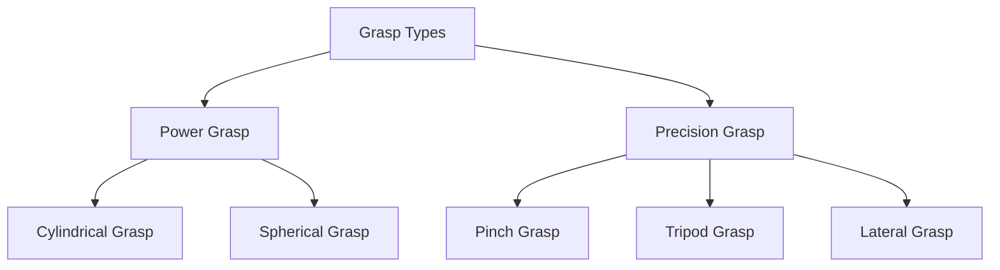

# Manipulation and Grasping with Humanoid Hands

Manipulation and grasping are crucial for humanoid robots to interact effectively with the physical world, performing tasks like picking up objects, opening doors, or using tools. Humanoid hands, with their complex designs, aim to mimic the dexterity and adaptability of human hands, presenting unique challenges and opportunities for control.

## Humanoid Hand Design

Humanoid hands vary widely in design, from simple two-finger grippers to highly anthropomorphic multi-fingered hands. Key design considerations include:
-   **Degrees of Freedom (DoF)**: The number of controllable joints. More DoF allows for greater dexterity but increases control complexity.
-   **Underactuation**: Many advanced hands use underactuated designs, where fewer motors control more joints, leveraging mechanical coupling for simpler control and compliant grasping.
-   **Sensor Integration**: Force/torque sensors in fingertips, tactile sensors on surfaces, and proprioceptive sensors (joint encoders) provide crucial feedback.
-   **Material Compliance**: Soft fingertips or compliant structures enhance grasping robustness and adaptability to object shapes.

## Grasp Types and Taxonomy

Grasps can be broadly classified based on how the fingers contact and secure an object:



-   **Power Grasp**: Involves a large contact area between the object and the palm/fingers, providing high stability and force. Examples include cylindrical (holding a can) or spherical (holding a ball) grasps.
-   **Precision Grasp**: Uses fingertips for fine manipulation, offering high dexterity and control for small or delicate objects. Examples include pinch (using thumb and index finger) or tripod (using thumb, index, and middle finger) grasps.

## Grasp Planning Algorithms

**Grasp planning algorithms** aim to determine the optimal hand pose and finger joint angles to successfully grasp an object. This is a complex problem influenced by:
-   **Object Geometry**: Shape, size, and material properties of the object.
-   **Robot Kinematics**: The hand's reach and dexterity.
-   **Task Requirements**: Whether the grasp needs to be stable, allow for manipulation, or resist external forces.

Common approaches include:
-   **Analytical Methods**: Use geometric analysis to find stable grasp points.
-   **Data-driven Methods**: Train neural networks on large datasets of successful grasps.
-   **Grasp Quality Metrics**: Evaluate potential grasps based on metrics like wrench closure (ability to resist external forces) or form closure (ability to restrain object movement).

## Force Control

**Force control** enables robots to interact with the environment with a desired force, rather than just position. This is essential for:
-   **Delicate Object Handling**: Preventing damage by limiting applied force.
-   **Assembly Tasks**: Inserting pegs into holes, where slight misalignments require force feedback.
-   **Human-Robot Collaboration**: Ensuring safe physical interaction with humans.

Types of force control:
-   **Impedance Control**: Controls the robot's apparent stiffness and damping.
-   **Admittance Control**: Controls the robot's apparent mass and compliance.
-   **Hybrid Force/Position Control**: Combines position control in some directions with force control in others.

### Example: Grasp Planner and Force Controller Code (Conceptual)

```python
# Conceptual Python code for a grasp planner and simple force controller

import numpy as np
from geometry_msgs.msg import Pose, WrenchStamped # ROS 2 message types

class HumanoidHandController:
    def __init__(self):
        self.current_joint_angles = np.zeros(16) # Example: 16 joints in hand
        self.ft_sensor_data = WrenchStamped() # Force/Torque sensor data

    def plan_grasp(self, object_pose: Pose, object_geometry_type: str):
        """
        Conceptual grasp planning function.
        Determines optimal finger joint angles and hand pose for grasping.
        """
        self.get_logger().info(f"Planning grasp for {object_geometry_type} at {object_pose.position}")
        
        # Placeholder for complex grasp planning algorithm
        # - Analyze object mesh or primitive shape
        # - Search for stable contact points
        # - Compute inverse kinematics for hand to reach pre-grasp pose
        # - Compute finger joint trajectories for closing grasp

        target_hand_pose = Pose() # Desired hand pose relative to robot base
        finger_joint_targets = np.array([0.1, 0.2, 0.3, ...]) # Target angles for fingers
        
        self.get_logger().info("Grasp plan generated.")
        return target_hand_pose, finger_joint_targets

    def apply_force_control(self, desired_force, current_force_sensor_data: WrenchStamped):
        """
        Conceptual force control loop for grasping or interaction.
        """
        self.get_logger().info(f"Applying force control. Desired: {desired_force}, Current: {current_force_sensor_data.wrench.force.z}")

        # Example: Simple proportional force control on Z-axis (up/down)
        error = desired_force - current_force_sensor_data.wrench.force.z
        
        # Proportional gain (Kp)
        Kp = 0.1
        
        # Compute joint torques to achieve desired force
        # This is a highly simplified conceptualization
        joint_torques_command = np.zeros_like(self.current_joint_angles)
        
        # Apply torque to a specific joint, e.g., wrist
        # joint_torques_command[wrist_joint_index] = Kp * error
        
        return joint_torques_command # Commands to be sent to robot
    
    def get_logger(self):
        # Placeholder for logging
        import logging
        return logging.getLogger(__name__)

# Example usage (conceptual)
# controller = HumanoidHandController()
# object_to_grasp_pose = Pose() # Fill with actual pose
# target_hand_pose, finger_targets = controller.plan_grasp(object_to_grasp_pose, "cube")
#
# # Simulate moving to pre-grasp, then grasping with force control
# current_force = WrenchStamped() # Fill with simulated or real sensor data
# torques = controller.apply_force_control(desired_force=5.0, current_force_sensor_data=current_force)
```

## Object Manipulation

Beyond simple grasping, humanoid robots need to perform complex object manipulation tasks, which often involve a sequence of grasps, releases, and re-grasps. Examples include:
-   **Reorientation**: Changing an object's orientation in the hand.
-   **Tool Use**: Holding and operating tools (e.g., screwdriver, wrench).
-   **Assembly**: Placing components together with precision.

These tasks typically combine perception (vision for object pose), planning (motion planning for arm and hand), and execution (force-controlled grasping and movement).

## Tool Use

Tool use is a sophisticated form of manipulation where the robot uses an external object to interact with the environment. This requires:
-   **Tool Grasping**: Securely grasping the tool.
-   **Tool Kinematics**: Understanding the kinematic transformation from the robot's hand to the tool's end-effector.
-   **Task-Space Control**: Controlling the tool's pose in the environment rather than the robot's hand directly.
-   **Force Feedback**: Using force feedback to effectively operate the tool.
